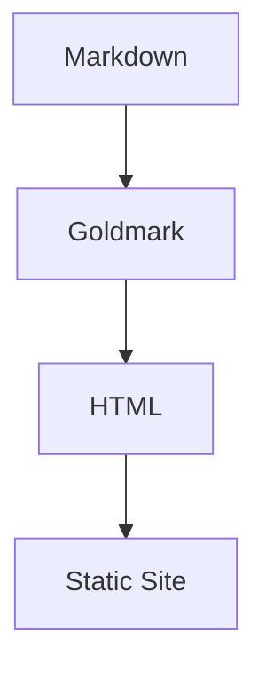

# Chenhai 使用教程

本文档带你从零开始，完成一个博客站点的创建、写作、预览和发布。

## 目录

- [1. 安装](#1-安装)
- [2. 创建站点](#2-创建站点)
- [3. 配置站点](#3-配置站点)
  - [阅读设置](#阅读设置)
- [4. 写文章](#4-写文章)
- [5. 预览](#5-预览)
- [6. 构建与部署（CI 自动）](#6-构建与部署)
  - [站点健康检查](#站点健康检查)
- [7. 主题自定义](#7-主题自定义)
- [8. Markdown 写作指南](#8-markdown-写作指南)
  - [键盘快捷键](#键盘快捷键)
- [9. 图床配置](#9-图床配置)
- [10. Front Matter 参考](#10-front-matter-参考)

---

## 1. 安装

从源码编译（需要 Go 1.21+）：

```bash
git clone https://github.com/KurongTohsaka/chenhai-hugo.git
cd chenhai-hugo
go build -o chenhai ./cmd/chenhai/
```

将 `chenhai` 移动到 `$PATH` 中任意目录即可全局使用：

```bash
sudo mv chenhai /usr/local/bin/
```

## 2. 创建站点

```bash
# 在当前目录创建
chenhai init

# 或指定路径
chenhai init my-blog
cd my-blog
```

生成目录结构：

```
my-blog/
├── config.yaml          ← 站点配置
├── content/
│   └── posts/           ← 文章目录
├── static/              ← 静态资源
└── archetypes/          ← 内容原型
```

## 3. 配置站点

在站点根目录创建 `config.yaml`：

```yaml
# 站点元信息
title: "镇海阁"
subtitle: "读书、记事、静观沧海"
description: "一个安静写字的地方"
baseURL: "https://example.com"
language: "zh-CN"
copyright: "CC BY-NC-SA 4.0"

# 作者信息
author:
  name: "指挥官"
  avatar: "/images/avatar.webp"
  bio: "读书写字，编程生活"

# 主题配置
theme: "zhenhai"
themeConfig:
  colorMode: "auto"        # light | dark | auto
  showToc: true            # 显示文章目录
  tocFloat: true           # 浮动式目录
  codeTheme: "github-dark" # Chroma 高亮主题
  dateFormat: "2006-01-02"
  postsPerPage: 10         # 每页文章数

# 导航菜单
menu:
  - name: "首页"
    url: "/"
  - name: "归档"
    url: "/archives/"
  - name: "标签"
    url: "/tags/"
  - name: "关于"
    url: "/about/"

# Markdown 渲染
markup:
  highlight:
    style: "github-dark"
    lineNumbers: true
    showFilename: true
  math:
    engine: "katex"
  mermaid: true
  toc:
    minDepth: 2
    maxDepth: 4

# 社交链接
social:
  github: "https://github.com/yourname"

# SEO
seo:
  enableRobotsTXT: true
  enableSitemap: true

# 标签描述（标签页顶部展示）
tagDescriptions:
  Go: "Go 语言学习与实践"
  Python: "Python 编程笔记"
```

**默认值**：所有配置项都有合理默认值，最简只需填 `title`。

### 阅读设置

访问博客时，点击页面顶部导航栏的 ⚙ 图标，可以调节：

- **字号**：小 / 中 / 大三档，偏好自动保存在浏览器中
- **阅读宽度**：窄栏（680px）/ 宽栏切换，适合不同屏幕
- **暗色深度**：柔和 / 适中 / 深邃三档（仅暗色模式下可用）

快捷键：按 `?` 查看所有键盘快捷键。

## 4. 写文章

### 使用命令行创建

```bash
chenhai new posts/hello-world.md -c "技术" -t "博客,Go"
```

### 手动创建

在 `content/posts/` 下创建 `.md` 文件：

```markdown
---
title: "我的第一篇博客文章"
date: 2026-05-28
categories: ["技术"]
tags: ["博客", "Chenhai"]
toc: true
---

## 正文开始

这里写你的内容。


```

### 独立页面

在 `content/` 下创建子目录，放入 `index.md`：

```
content/about/
└── index.md            ← /about/ 独立页面
```

## 5. 预览

```bash
chenhai serve
```

打开 `http://localhost:1313`。修改内容后自动重建并推送 LiveReload。

```bash
chenhai serve --port 8080    # 自定义端口
```

## 6. 构建与部署

### 工作流

```
chenhai deploy -m "add: 新文章"   →   GitHub Actions 自动构建   →   Pages 部署
```

不再需要本地 `chenhai build`。日常部署一条命令：

```bash
chenhai deploy -m "add: 新文章标题"
```

等价于 `git add → git commit → git push`，推送后 CI 自动构建。

### 本地构建

如需检查输出：

```bash
chenhai build
```

输出 `public/` 目录：

```
public/
├── index.html
├── posts/          ← 文章页
├── categories/     ← 分类聚合
├── tags/           ← 标签云 + 标签页
├── archives/       ← 时间线归档
├── search-index.json
├── sitemap.xml / robots.txt
└── assets/         ← 主题静态资源
```

### CI 配置

创建 `.github/workflows/deploy.yml`（参见 [workflow.md](workflow.md) 完整模板）。关键步骤：

```yaml
- name: Build Chenhai
  run: |
    git clone https://github.com/KurongTohsaka/Chenhai-hugo.git /tmp/chenhai
    cd /tmp/chenhai && go build -o /usr/local/bin/chenhai ./cmd/chenhai/
- name: Build site
  run: chenhai build
- name: Deploy
  uses: peaceiris/actions-gh-pages@v3
  with:
    publish_dir: ./public
```

### 静态托管

`public/` 目录可直接部署到 Nginx / Vercel / Cloudflare Pages 等任意托管平台。

### 站点健康检查

使用 `chenhai doctor` 检测站点配置和内容完整性：

```bash
chenhai doctor
```

检测项包括：
- `config.yaml` 语法正确性
- `content/` 目录下所有 `.md` 文件的 Front Matter 格式
- 必需模板文件完整性
- `static/` 目录和缓存文件状态

输出示例：

```
🔍 Chenhai Doctor — 站点健康检查

✓ config.yaml 语法正确
✓ content/ 目录存在（108 个 .md 文件）
✓ 所有必需模板存在
✓ static/ 目录存在
✓ .chenhai-cache.json 存在

✓ 站点健康检查通过，一切正常
```

## 7. 主题自定义

### 覆盖模板

在站点根目录创建 `layouts/`，放入与内置主题同名的文件即可覆盖：

```bash
mkdir -p layouts/partials
```

例如自定义头部 `layouts/partials/header.html`：

```html
{{define "header"}}
<header class="site-header">
  <a class="site-brand" href="/">{{.Config.Title}}</a>
  <nav>
    {{range .Config.Menu}}
    <a href="{{.URL}}">{{.Name}}</a>
    {{end}}
  </nav>
  <button id="theme-toggle">☾</button>
</header>
{{end}}
```

### 替换主题图片

站点根目录 `static/` 下的文件会直接复制到 `public/`，可覆盖主题内置文件。

镇海角色图片位于主题 `assets/images/`，站点内引用路径为 `/assets/images/`。替换同名 webp/png 即可换图：
- `/assets/images/hero.svg` — 首页头图
- `/assets/images/about-zhenhai.svg` — 关于页角色图

### 主题优先级

```
站点 layouts/ > 外部主题目录 > 内置镇海主题
```

### 外部主题

除了内置镇海主题，Chenhai 支持加载 `themes/` 目录下的外部主题：

```bash
# 使用脚手架创建
chenhai new theme my-theme

# 在 config.yaml 中切换
theme: "my-theme"
```

外部主题只需包含你想覆盖的文件。缺失的模板和资源自动回退到镇海主题。

**目录结构**：

```
themes/my-theme/
├── theme.yaml              ← 主题名、版本、自定义参数
├── layouts/                ← 模板文件（覆盖镇海）
│   ├── base.html
│   └── index.html
├── assets/                 ← CSS/JS/图片（覆盖镇海）
│   └── css/style.css
└── static/                 ← 不处理的静态文件（叠加镇海）
```

**主题参数**：

`theme.yaml` 中定义默认参数：

```yaml
name: "my-theme"
version: "1.0.0"
params:
  primaryColor: "#1a3650"
  showAuthor: true
```

用户在 `config.yaml` 的 `themeConfig` 中可覆盖：

```yaml
themeConfig:
  primaryColor: "#8b1a2b"
```

模板中访问：

```html
{{.Config.ThemeConfig.Params.primaryColor}}
```

## 8. Markdown 写作指南

### 基础格式

```markdown
**粗体** | *斜体* | ~~删除线~~ | `行内代码`
```

### 代码块

使用三个反引号包裹，指定语言即可触发 Chroma 语法高亮：

````markdown
```python
def hello():
    print("Hello, Chenhai!")
```
````

代码块自带 **Copy 按钮**，点击复制代码到剪贴板。

### 数学公式（KaTeX）

行内公式：

```markdown
$E = mc^2$
```

块级公式：

```markdown
$$
\int_0^1 x^2 dx = \frac{1}{3}
$$
```

页面包含数学公式时会**自动注入 KaTeX JS/CSS**（CDN），无需额外配置。

### Mermaid 图表

使用 `mermaid` 语言标记的代码块：

````markdown

````

页面包含 Mermaid 代码块时会**自动注入 Mermaid.js**（CDN），渲染为 SVG 矢量图表。

### 表格

```markdown
| 特性 | 状态 | 说明 |
|------|------|------|
| GFM 表格 | ✅ | 已支持 |
| 代码高亮 | ✅ | Chroma 引擎 |
```

### 任务列表

```markdown
- [x] 完成的任务
- [ ] 待办事项
```

### 提示框（Admonition）

```markdown
> [!note]
> 这是一个普通提示。

> [!warning]
> 这是一个警告。

> [!tip]
> 这是一个小技巧。

> [!danger]
> 这是一个危险警告。
```

四种类型分别渲染为对应的样式化容器（笔记/注意/提示/危险）。

### 脚注

```markdown
Hugo[^1] 是一个流行的静态博客生成器。

[^1]: Hugo 由 Steve Francia 创立，使用 Go 编写。
```

### 图片

```markdown

```

图片会自动包裹 `<figure>` + `<figcaption>`，添加 `loading="lazy"` 懒加载。支持对齐：

```markdown
   # 居中
    # 右对齐
```

### 音频 & 视频

```markdown
<video src="/videos/demo.mp4" controls></video>
<audio src="/audio/podcast.mp3" controls></audio>
```

### 键盘快捷键

在博客页面按下 `?` 查看快捷键面板：

| 快捷键 | 功能 |
|--------|------|
| `J` / `K` | 上一篇 / 下一篇 |
| `Ctrl+K` | 搜索 |
| `G H` | 回到首页 |
| `G T` | 回到顶部 |
| `?` | 快捷键面板 |
| `Esc` | 关闭面板 |

## 9. 图床配置

支持 GitHub 仓库作为图片托管。在 `config.yaml` 中配置：

```yaml
imageHost:
  enabled: true
  provider: "github"
  repo: "yourname/images"
  branch: "main"
  basePath: "images/"
  token: ""                 # 或设置环境变量 CHENHAI_IMG_TOKEN
  mode: "auto"              # auto | map
  baseURL: ""               # map 模式下的自定义 URL 前缀
```

### auto 模式

构建时自动将本地相对路径图片通过 GitHub API 上传到指定仓库，并将 Markdown 中的路径替换为 `https://raw.githubusercontent.com/...` CDN URL。

- 同名同 hash 图片跳过重复上传
- 上传失败不阻断构建，保留原始路径

### map 模式

仅做路径映射，不上传。适合图片已手动上传好的场景。将本地路径替换为 `{baseURL}/{filename}`。

### 环境变量

GitHub Token 可通过环境变量 `CHENHAI_IMG_TOKEN` 设置，避免写入配置文件。

## 10. Front Matter 参考

### 完整字段

```yaml
---
# 基础信息
title: "文章标题"             # 必填
date: 2026-05-28              # 必填，支持日期格式 + ISO 8601
lastmod: 2026-06-01           # 最后修改日期
draft: true                   # 草稿（构建时不生成页面）

# 分类与标签
categories: ["技术", "Go"]    # 层级分类
tags: ["静态博客", "Go"]       # 多个标签

# URL 控制
slug: "custom-url"            # 自定义 URL 标识符
url: "/special/path/"         # 完全自定义路径
weight: 5                     # 排序权重（越小越靠前）

# 展示控制
description: "SEO 描述"        # meta description
summary: "文章摘要"             # 列表页摘要（不填则自动截取）
toc: true                     # 是否生成目录
math: false                   # 是否启用数学公式
cover: "/images/cover.webp"   # 文章封面图 URL（首页卡片和文章顶部横幅）
pinned: true                  # 置顶文章，始终排在最前
---
```

### 优先级

```
Front Matter > config.yaml > 内建默认值
```

URL 生成优先级：`url` > `slug` > 文件路径

---

## 下一步

- 阅读[规划文档](planning.md)了解当前进展和后续计划
- 探索[规格文档](superpowers/specs/)了解详细设计
- 查看[示例博客](../testdata/example-blog/)获取完整参考
