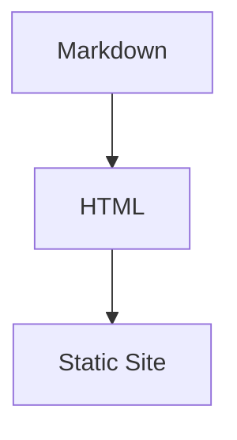

# Chenhai 使用教程

本文档将带你从零开始，完成一个博客站点的创建、写作、预览和发布。

## 目录

- [1. 安装](#1-安装)
- [2. 创建站点](#2-创建站点)
- [3. 配置站点](#3-配置站点)
- [4. 写文章](#4-写文章)
- [5. 预览](#5-预览)
- [6. 构建与部署](#6-构建与部署)
- [7. 主题自定义](#7-主题自定义)
- [8. Markdown 写作指南](#8-markdown-写作指南)
- [9. Front Matter 参考](#9-front-matter-参考)

---

## 1. 安装

从源码编译（需要 Go 1.21+）：

```bash
git clone https://github.com/KurongTohsaka/chenhai-hugo.git
cd chenhai-hugo
go build -o chenhai ./cmd/chenhai/
```

将 `chenhai` 移动到 `$PATH` 中任意目录即可全局使用：

```bash
sudo mv chenhai /usr/local/bin/
```

## 2. 创建站点

```bash
# 创建站点目录
mkdir my-blog && cd my-blog

# 创建内容目录
mkdir -p content/posts content/about static/images
```

此时目录结构：

```
my-blog/
├── content/
│   ├── posts/          ← 文章目录
│   └── about/          ← 独立页面
└── static/
    └── images/         ← 图片等静态资源
```

## 3. 配置站点

在站点根目录创建 `config.yaml`：

```yaml
# 站点元信息
title: "镇海阁"
subtitle: "读书、记事、静观沧海"
description: "一个安静写字的地方"
baseURL: "https://example.com"
language: "zh-CN"
copyright: "CC BY-NC-SA 4.0"

# 作者信息
author:
  name: "指挥官"
  avatar: "/images/avatar.webp"
  bio: "读书写字，编程生活"

# 主题配置
theme: "zhenhai"
themeConfig:
  colorMode: "auto"        # light | dark | auto
  showToc: true            # 显示文章目录
  tocFloat: true           # 浮动式目录
  codeTheme: "github-dark" # Chroma 高亮主题
  dateFormat: "2006-01-02"
  postsPerPage: 10         # 每页文章数

# 导航菜单
menu:
  - name: "首页"
    url: "/"
  - name: "归档"
    url: "/archives/"
  - name: "标签"
    url: "/tags/"
  - name: "关于"
    url: "/about/"

# Markdown 渲染
markup:
  highlight:
    style: "github-dark"
    lineNumbers: true
    showFilename: true
  math:
    engine: "katex"
  mermaid: true
  toc:
    minDepth: 2
    maxDepth: 4

# 社交链接
social:
  github: "https://github.com/yourname"

# SEO
seo:
  enableRobotsTXT: true
  enableSitemap: true
```

**默认值**：所有配置项都有合理默认值。最简 `config.yaml` 只需 `title` 即可运行。

## 4. 写文章

### 使用命令行创建

```bash
chenhai new posts/hello-world.md
```

这会自动创建文件并填充默认 Front Matter：

```markdown
---
title: "hello-world"
date: 2026-05-28
draft: true
categories: []
tags: []
---

```

### 手动创建

直接在 `content/posts/` 下创建 `.md` 文件：

```markdown
---
title: "我的第一篇博客文章"
date: 2026-05-28
categories: ["生活"]
tags: ["博客", "Chenhai"]
description: "使用 Chenhai 写的第一篇文章"
toc: true
---

## 缘起

今天开始了我的博客之旅。使用自制的静态博客生成器。

## 代码示例

```go
package main

import "fmt"

func main() {
    fmt.Println("Hello, Chenhai!")
}
```

## 数学公式

$E = mc^2$

这就是我的第一篇博客。
```

### 独立页面

在 `content/` 下创建子目录，放入 `index.md`：

```
content/about/
└── index.md            ← 关于页面
```

Front Matter 中设置 `url` 可自定义访问路径：

```yaml
---
title: "关于我"
date: 2026-05-01
url: "/about/"
---
```

## 5. 预览

```bash
chenhai serve
```

打开浏览器访问 `http://localhost:1313`。

修改内容后自动重建并推送 LiveReload 到浏览器。

可选参数：

```bash
chenhai serve --port 8080    # 自定义端口
```

## 6. 构建与部署

### 构建

```bash
chenhai build
```

输出到 `public/` 目录：

```
public/
├── index.html             ← 首页
├── posts/
│   └── hello-world/
│       └── index.html     ← 文章页
├── categories/
│   └── 生活/
│       └── index.html     ← 分类页
├── tags/
│   ├── index.html         ← 标签云
│   └── 博客/
│       └── index.html     ← 标签页
├── archives/
│   └── index.html         ← 时间线归档
├── search-index.json      ← 搜索索引
├── sitemap.xml
├── robots.txt
└── assets/                ← 主题静态资源
    ├── css/
    └── js/
```

### 部署

`public/` 目录是纯静态文件，可直接部署到任何静态托管服务：

**GitHub Pages**：

```bash
# 将 public/ 推送到 gh-pages 分支
cd public
git init
git add -A
git commit -m "deploy"
git push -f git@github.com:yourname/yourname.github.io.git main
```

**Nginx**：将 `public/` 指向 Nginx 的 `root` 即可。

**Cloudflare Pages / Vercel / Netlify**：构建命令设为 `chenhai build`，输出目录设为 `public`。

## 7. 主题自定义

### 覆盖模板

在站点根目录创建 `layouts/` 目录，放入与内置主题同名的文件即可覆盖。

例如，自定义头部导航：

```bash
mkdir -p layouts/partials
```

创建 `layouts/partials/header.html`：

```html
{{define "header"}}
<header class="site-header">
  <a class="site-brand" href="/">{{.Config.Title}}</a>
  <nav>
    <a href="/">首页</a>
    <a href="/about/">关于</a>
  </nav>
  <!-- 暗色模式切换 -->
  <button id="theme-toggle" aria-label="Toggle dark mode">☾</button>
</header>
{{end}}
```

### 覆盖静态资源

在 `static/` 目录下放置文件，构建时会直接复制到 `public/` 根目录。

```bash
static/
├── images/
│   └── avatar.webp
├── favicon.ico
└── CNAME                ← GitHub Pages 自定义域名
```

### 主题优先级

```
站点 layouts/ > 外部主题目录 > 内置镇海主题
```

未覆盖的部分自动回退到镇海主题，无需从零开始写整个主题。

## 8. Markdown 写作指南

### 文本格式

```markdown
**粗体** | *斜体* | ~~删除线~~ | `行内代码`
```

### 标题

```markdown
## 二级标题
### 三级标题
#### 四级标题
```

标题会自动生成 ID，用于 TOC 目录链接。

### 代码块

使用三个反引号包裹，指定语言：

````markdown
```python
def hello():
    print("Hello, Chenhai!")
```
````

可选地在第一行标注文件名：

````markdown
```go filename="main.go"
package main
func main() { fmt.Println("Hi") }
```
````

### 数学公式

行内公式：`$E = mc^2$`

块级公式：

```markdown
$$
\int_0^1 x^2 dx = \frac{1}{3}
$$
```

### Mermaid 图表

````markdown

````

### 表格

```markdown
| 特性 | 状态 | 说明 |
|------|------|------|
| GFM 表格 | ✅ | 已支持 |
| 代码高亮 | ✅ | Chroma 引擎 |
```

### 任务列表

```markdown
- [x] 完成的任务
- [ ] 待办事项
```

### 提示框（Admonition）

```markdown
> [!note]
> 这是一个普通提示。

> [!warning]
> 这是一个警告。

> [!tip]
> 这是一个小技巧。

> [!danger]
> 这是一个危险警告。
```

### 脚注

```markdown
Hugo[^1] 是一个流行的静态博客生成器。

[^1]: Hugo 由 Steve Francia 创立，使用 Go 编写。
```

### 图片与媒体

```markdown


<video src="/videos/demo.mp4" controls></video>
```

## 9. Front Matter 参考

每篇 Markdown 文件头部的 `---` 包裹区域，用于定义文章元数据。

### 完整字段

```yaml
---
# 基础信息
title: "文章标题"           # 必填
date: 2026-05-28            # 必填，支持 2006-01-02 / ISO 8601
lastmod: 2026-06-01         # 最后修改日期
draft: true                 # 草稿（不生成页面）

# 分类与标签
categories: ["技术", "Go"]  # 层级分类
tags: ["静态博客", "Go"]     # 多个标签

# URL 控制
slug: "custom-url"          # 自定义 URL 标识符
url: "/special/path/"       # 完全自定义路径
weight: 5                   # 排序权重（越小越靠前）

# 展示控制
description: "SEO 描述"      # meta description
summary: "文章摘要"           # 列表页摘要（不填则自动截取）
toc: true                   # 是否生成目录（覆盖站点设置）
math: false                 # 是否启用数学公式（覆盖站点设置）
---
```

### 字段优先级

对于 URL 生成：`url` > `slug` > 文件路径

对于配置项：`Front Matter` > `config.yaml` > 内建默认值

---

## 下一步

- 阅读 [规划文档](planning.md) 了解当前进展和后续计划
- 探索 [规格文档](superpowers/specs/) 了解详细设计
- 查看 [示例博客](../testdata/example-blog/) 获取完整参考
