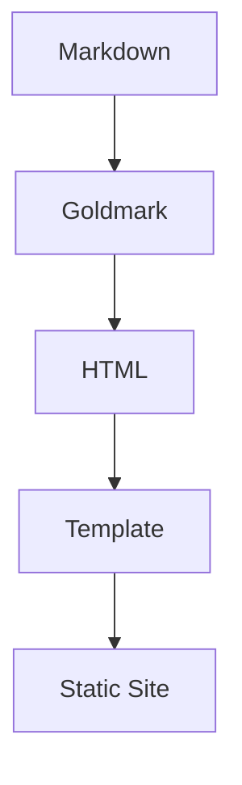

## 缘起

我一直想有一个属于自己的博客空间。

市面上有诸多成熟的静态博客方案：**Hexo**、**Hugo**、**Jekyll**...但它们都有一个共同的问题——太庞杂了。

> 一个工具应该足够简单，让使用者专注于写作本身。
> ——匿名

## 技术选型

选择 Go 语言的理由：

1. **单一二进制**：无需安装任何运行时依赖
2. **性能卓越**：编译速度快，运行效率高
3. **类型安全**：编译期就能捕获大部分错误

### Goldmark 渲染管道

```go
package main

import (
    "fmt"
    "github.com/yuin/goldmark"
)

func main() {
    md := goldmark.New()
    var buf bytes.Buffer
    if err := md.Convert([]byte("# Hello"), &buf); err != nil {
        fmt.Println("render error:", err)
    }
    fmt.Println(buf.String())
}
```

## 数学公式支持

行内公式：$E = mc^2$

块级公式：

$$
\int_0^1 x^2 dx = \frac{1}{3}
$$

## Mermaid 图表



## 任务列表

- [x] 项目骨架搭建
- [x] YAML 配置系统
- [ ] RSS 订阅支持
- [ ] 多语言支持

## 结语

这条路还很长，但我喜欢每一步的风景。感谢镇海的陪伴。

---

*镇海：指挥官，今天的文书处理完了吗？*
